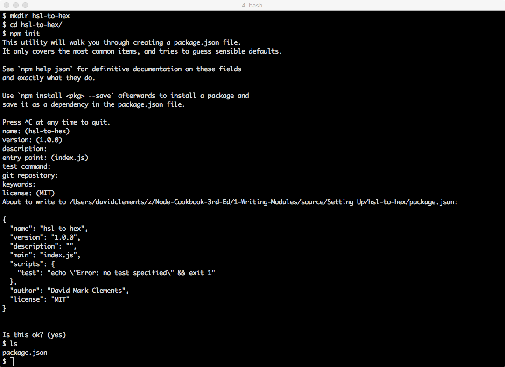

# 1 Writing Modules

This chapter covers the following topics

* Node's module system
* NPM's package tooling and infrastructure
* Initializing a module
* Setting up developer tooling for module writing
* Best practices
* Decomposition
* Publishing to NPM privately

## Introduction

In idiomatic Node, a module is a fundamental unit of logic. Applications or systems should consist of many generic modules composed together while domain specific logic ties modules together at the application level. In this chapter we'll learn how Node's module system works, how to create modules for various scenarios and how we can reuse and share our code.


## Scaffolding a Module

### Getting Ready

> #### Installing Node
> <!--tip-->
> If we don't already have Node installed, we can go to <https://nodejs.org> to pick up the latest version for our operating system.

If Node is on our system, then so is the `npm` executable. 

`npm` is the default package manager for Node, it's useful for 
creating, managing, installing and publishing modules. 

Before we run any commands, let's tweak the `npm` configuration
a little:

```sh
npm config set init.author.name "<name here>"
```

This will speed up module creation and ensure each package we create has a consistent author name, thus avoiding typos and variation of our name. 


> #### npm stands for..
> <!-- info -->
> Contrary to popular belief, `npm` is not an acronym for
> Node Package Manager, in fact it stands for "npm is Not 
> An Acronym", which is why it's not called NINAA.


### How to do it

Let's say we want to create a module that converts HSL (hue, saturation, luminosity) values into a hex based RGB representation, such as would be used in CSS (for example: `#fb4a45`).

`hsl-to-hex` seems like a good name, so let's make a new 
folder for our module and `cd` into it.

```sh
mkdir hsl-to-hex
cd hsl-to-hex
```

Every Node module must have a `package.json` file, which holds
meta data about the module. 

We can of course create this manually, but there is a better way. 

We can simply execute the following command in our newly created module folder:

```sh
npm init
```

This will ask a series of questions. We can hit enter for every question without supplying an answer. Notice how `name` field is taken from the folder name, and the `author` field is taken from the `init.author.name` value we set earlier on. 



* An `npm init` should look like this *


Upon completion we should have a `package.json` file in that looks something like this:

```json
{
  "name": "hsl-to-hex",
  "version": "1.0.0",
  "description": "",
  "main": "index.js",
  "scripts": {
    "test": "echo \"Error: no test specified\" && exit 1"
  },
  "author": "David Mark Clements",
  "license": "MIT"
}
$ cat package.json
{
  "name": "hsl-to-hex",
  "version": "1.0.0",
  "description": "",
  "main": "index.js",
  "scripts": {
    "test": "echo \"Error: no test specified\" && exit 1"
  },
  "author": "David Mark Clements",
  "license": "MIT"
}
```

### How it Works


### There's More

#### Reinitializing

Sometimes additional meta data can be available after the
original `npm init`. The classic circumstance is when we 
initialise the module a Git repository and add a remote 
endpoint.

---

##### Git and GitHub

If we've not heard or used the `git` tool and GitHub before,
refer to <http://help.github.com> to get started.

If we don't have a GitHub account we can head to <http://github.com> to get a free account.

---

To demonstrate, let's create a GitHub repository for our module.
Head to GitHub and click the plus symbol in the top right, then select
"new repository".


* select new repository *

Specify the name as "hsl-to-hex" and click "Create Repository".

Back in the terminal, inside our module folder, we can now run:

```sh
git init
git add package.json
git commit -m '1st'
git remote add origin http://github.com/<username>/hsl-to-hex
git push -u origin master
```

Now here comes the magic part, let's initialize again (simply press enter for every question):

```sh
npm init
```


* reinitializing *

This time the Git remote we just added was detected and became the default answer for the "git repository" question. Accepting this default answer meant that the `repository`, `bugs` and `homepage` fields were added to `package.json`.

A repository field in the `package.json` is an important addition when it comes to publishing open source modules since it will be rendered on the corresponding module page on <http://npmjs.com>. Packages without a corresponding repository where code can be perused prior to download are far less likely to be installed and used.


#### Versioning

#### Eliminating The Need for Sudo

The `npm` executable can install both local and global
modules. 

On OSX and Linux the default `npm` set up requires `sudo`
access to install a module.

For example, this will fail on a typical OS X or Linux 
system with the default `npm` set up

```js
npm -g install cute-stack # <-- oh oh needs sudo
```


* set author
* global without sudo
* init


## Creating

* install deps
* write code
* go out of scope
* decompose into another module
- there's more
es6
tests/examples/readme
configuring npm author etc.

## Finding Dependencies


## Publishing 

## Private Repositories


